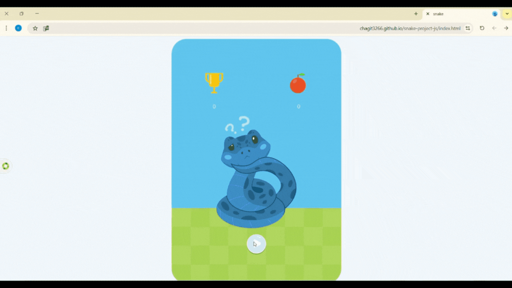

# Snake Game (JavaScript)

A classic Snake game implemented using vanilla JavaScript, HTML, and CSS.

The project focuses on core game logic, user interaction, and basic game flow,
including start, gameplay, and restart.

## Live Demo
https://chagit3266.github.io/snake-project-js/index.html

## Technologies
- JavaScript
- HTML
- CSS

## Notes
The project is implemented as a browser-based game and does not require any installation.
